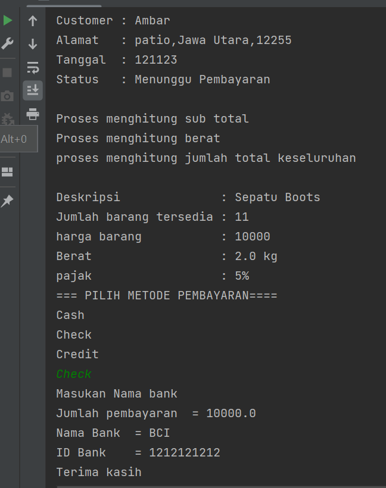

# PRAKTIKUM7
## Pemrograman Orientasi Objek

````shell
Nama   : Ikram Ramadhan
Nim    : 312110478
Matkul : Pemrograman Orientasi Objek
````

### 1. File customer.java
* *CODINGAN FILE 1

```java
package Praktikum8;

public class Customer {
    private String name;
    private String alamat;

    public String getAlamat() {
        return alamat;
    }

    public String getName() {
        return name;
    }

    public Customer(String name , String alamat){
        this.name = name;
        this.alamat = alamat;
    }
}

```

### 2.File Order.java
* *CODINGAN FILE 2
```java
package Praktikum8;

import java.util.Arrays;

public class Order {

    //atribute datacustomer asosiasi dari Class customer
    private Customer dataCustomer;
    private final int date;
    private final String status;
    private OrderDetail jumlah;


    // operasi SubTotal asosiasi dari orderDetail
    public void SubTotal (){
        System.out.println("Proses menghitung sub total");
    }

    // operasi calcTax agregasi pada OrderDetail
    public void calcTax(){

        jumlah.calcTax();

    }

    public void Total(){

        System.out.println("proses menghitung jumlah total keseluruhan");
    }

    public void TotalWeight (){
        System.out.println("Proses menghitung berat");
    }

    // Menggunkan for untuk araylist
    public void infoOrderan(){

        for (String s : Arrays.asList("\n"+"Customer : "+ dataCustomer.getName() , "Alamat   : " + dataCustomer.getAlamat()
                ,"Tanggal  : " + date, "Status   : " + status+"\n")) {
            System.out.println(s);
        }

    }

    // Setter untuk Membuat data customer
    public void setDataCustomer(Customer dataCustomer) {
        this.dataCustomer = dataCustomer;
    }


    /* karena pada Customer ini menggunakan asosiasi saya tidak membuat object pada constructor,
    namun pada jumlah saya membuat parameter di constructor
     */
    public Order (int date, String status, OrderDetail jumlah){
        this.date = date;
        this.status = status;
        this.jumlah = jumlah;
    }

}


```
### 3. file Orderdetail.java
* *CODINGAN FILE 3
```java
package Praktikum8;

public class OrderDetail {
  private Item quantity;
  private final String taxStatus;

  // operator calcSubTotal asosiasi dari class Item
  public void calcSubTotal (){
    quantity.inStock();
  }
  // operator asosiasi dari class Item juga
  public void calcWeight (){
    System.out.println("Berat                  : " + quantity.getShipingWeight() +" kg");
  }

  //operator class ini sendiri
  public void calcTax (){
    System.out.println("pajak                  : " + taxStatus);
  }

  // setter
  public void setQuantity(Item quantity) {
    this.quantity = quantity;
  }

  public OrderDetail(String taxStatus) {
    this.taxStatus = taxStatus;
  }

}

```
### 4.Item.java
* *CODINGAN FILE 4
```java
package Praktikum8;

public class Item {

  private final float shipingWeight;
  private final String deskripsi;


  //method
  public void inStock(){

    System.out.println("\nDeskripsi              : Sepatu Boots");
    System.out.println("Jumlah barang tersedia : 11");
    System.out.println(getDeskripsi());

  }
  // getter
  public String getDeskripsi() {
    return deskripsi;
  }

  public double getShipingWeight() {
    return shipingWeight;
  }

  public Item(String deskripsi,Float shipingWeight) {
    this.deskripsi = deskripsi;
    this.shipingWeight = shipingWeight;
  }


}


```
### 5.Payment.java
* *CODINGAN FILE 4
```java
package Praktikum8;

public abstract class Payment{
    private float amount;

    public void Pembayaran(){

        System.out.println("Jumlah pembayaran  = " + amount);

    }

    public Payment(float amount) {
        this.amount = amount;
    }
}

```
### 6.Cash.java
* *CODINGAN FILE 4
```java
package Praktikum8;

public class Cash extends Payment{

  private float cash;

  @Override
  public void Pembayaran(){
    super.Pembayaran();
    System.out.println(cash);
  }

  public Cash(float amount, float cash) {
    super(amount);

  }
}

```
### 7.Check.java
* *CODINGAN FILE 4
```java
package Praktikum8;

public class Check extends Payment{

  private String name;
  private String bangID;


  @Override
  public void Pembayaran(){
    super.Pembayaran();
    System.out.println("Nama Bank  = " + name);
    System.out.println("ID Bank    = " +bangID );
  }

  public Check(float amount, String name, String bangID) {
    super(amount);
    this.name = name;
    this.bangID = bangID;

  }
}

````
### 8.Credit.java
* *CODINGAN FILE 4
```java
package Praktikum8;

import java.util.Date;

public class Credit extends Payment{

    private String number;
    private String tipe;
    private Order Expdate;


    public void Pembayaran(){

        super.Pembayaran();
        System.out.println("Nomer Pembayaran" + number);
        System.out.println("Tipe pembayran" + tipe);
        System.out.println(getExpdate());

    }

    public Credit(Float amount, String number, String tipe) {
        super(amount);
        this.number = number;
        this.tipe = tipe;
    }

    public Order getExpdate() {
        return Expdate;
    }

    public void setExpdate(Order expdate) {
        Expdate = expdate;
    }
}

````

* *Hasil output program:*
  