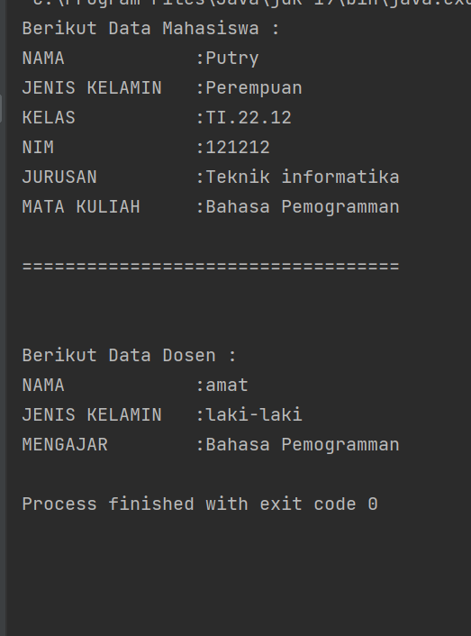

# PRAKTIKUM7
## Pemrograman Orientasi Objek

````shell
Nama   : Ikram Ramadhan
Nim    : 312110478
Matkul : Pemrograman Orientasi Objek
````

### 1. File customer.java
* *CODINGAN FILE 1

```java
package Praktikum8;

public class Customer {
    private String name;
    private String alamat;

    public String getAlamat() {
        return alamat;
    }

    public String getName() {
        return name;
    }

    public Customer(String name , String alamat){
        this.name = name;
        this.alamat = alamat;
    }
}

```

### 2.File Order.java
* *CODINGAN FILE 2
```java
package Praktikum8;

import java.util.Arrays;

public class Order {

    //atribute datacustomer asosiasi dari Class customer
    private Customer dataCustomer;
    private final int date;
    private final String status;
    private OrderDetail jumlah;


    // operasi SubTotal asosiasi dari orderDetail
    public void SubTotal (){
        System.out.println("Proses menghitung sub total");
    }

    // operasi calcTax agregasi pada OrderDetail
    public void calcTax(){

        jumlah.calcTax();

    }

    public void Total(){

        System.out.println("proses menghitung jumlah total keseluruhan");
    }

    public void TotalWeight (){
        System.out.println("Proses menghitung berat");
    }

    // Menggunkan for untuk araylist
    public void infoOrderan(){

        for (String s : Arrays.asList("\n"+"Customer : "+ dataCustomer.getName() , "Alamat   : " + dataCustomer.getAlamat()
                ,"Tanggal  : " + date, "Status   : " + status+"\n")) {
            System.out.println(s);
        }

    }

    // Setter untuk Membuat data customer
    public void setDataCustomer(Customer dataCustomer) {
        this.dataCustomer = dataCustomer;
    }


    /* karena pada Customer ini menggunakan asosiasi saya tidak membuat object pada constructor,
    namun pada jumlah saya membuat parameter di constructor
     */
    public Order (int date, String status, OrderDetail jumlah){
        this.date = date;
        this.status = status;
        this.jumlah = jumlah;
    }

}


```
### 3. file Orderdetail.java
* *CODINGAN FILE 3
```java
package Praktikum7;

public class Gender {
    // Atribute
    private String jenisKelamin;

    //method SETTER GETTER
    public String getJenisKelamin() {
        return jenisKelamin;
    }
    // Constructor class Gender
    public Gender(String jenisKelamin){
        this.jenisKelamin = jenisKelamin;
    }
}

```
### 4.Jurusan.java
* *CODINGAN FILE 4
```java
package Praktikum7;

public class Jurusan {
    // Atribute
    private String jurusan;

    // Method SETTER GETTER
    public String getJurusan() {
        return jurusan;
    }

    public Jurusan(String jurusan){
        this.jurusan = jurusan;
    }

}

```
### 5.Akademik.java
* *CODINGAN FILE 4
```java
package Praktikum7;


public class Akademik {
    // Call Methode
    public static void main(String[] args) {
        //Menampilkan hasil Agregasi class Mahasiswa pada class Gender
        Mahasiswa mhs =new Mahasiswa("Putry","TI.22.12",121212,new Gender("Perempuan"));
        //Menampilkan hasil Agregasi class Dosen pada class Gender
        Dosen dos = new Dosen("amat","Bahasa Pemogramman",new Gender("laki-laki"));
        // menampilkan Mata Kuliah dengan setter hasil Asosiasi Mahasiswa use a Dosen
        mhs.setDosen(dos);
        //Menampilkan Method
        mhs.infoMahasiswa();
        dos.infoDosen();
    }
}
```
* *Hasil output program:*
  